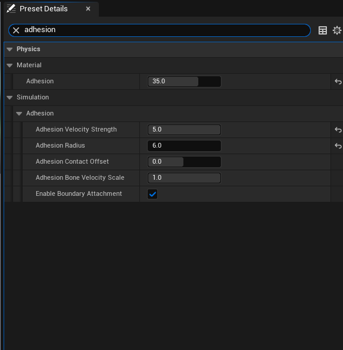

# Boundary Tagging Guide

Boundary Tagging is the system that allows fluid particles to **attach to and follow** characters and other moving objects. When a character walks through fluid, particles stick to the body, move with the skeleton, and naturally detach when the character moves fast enough. This creates realistic "wet character" effects like water clinging to legs or lava coating a body.

Particles near a boundary surface are tagged with the **Near Boundary** flag (shown in green). These particles are eligible for adhesion forces and attachment behavior, while default particles (blue) simulate freely.

---

## Prerequisites

Before setting up Boundary Tagging, ensure you have:

- A **Kawaii Fluid Volume** with a **Preset** assigned (see [Getting Started](getting-started.md))
- A character (or any actor) with a **Skeletal Mesh** or **Static Mesh** that has collision primitives
- A `UKawaiiFluidInteractionComponent` added to the actor

---

## Setup

### Step 1: Add the Interaction Component

Add a `KawaiiFluidInteractionComponent` to your character Blueprint. This component handles collision and boundary particle generation.

### Step 2: Enable Boundary Particles

In the Interaction Component's Details panel, find the **Fluid Interaction > Boundary Particles** category and enable **Enable Boundary Particles**. This generates a set of surface-sampled particles on the mesh that the GPU uses as attachment anchors.

| Setting | Description | Default |
| --- | --- | --- |
| **Enable Boundary Particles** | Master toggle for the boundary particle system. | Off |
| **Boundary Particle Spacing** | Distance between generated surface points (cm). Lower = denser coverage, higher GPU cost. | 5.0 |
| **Boundary Friction Coefficient** | Coulomb friction applied to particles touching the surface. 0 = frictionless, 2 = maximum grip. | 0.6 |

### Step 3: Configure the Preset (Adhesion)

Select your **Fluid Preset** data asset and adjust the **Physics > Simulation > Adhesion** parameters. These control how strongly fluid sticks to boundaries.

| Setting | Description | Default | Range |
| --- | --- | --- | --- |
| **Adhesion** (Material) | Base adhesion force pulling fluid toward boundary surfaces. | 5.0 | 0.0 ~ 50.0 |
| **Adhesion Velocity Strength** | How much fluid velocity matches the boundary's movement. Higher = fluid follows the surface more tightly. | 0.5 | 0.0 ~ 5.0 |
| **Adhesion Radius** | Maximum distance (cm) for adhesion force to apply. | 25.0 | 0.1+ |
| **Adhesion Contact Offset** | Allows deeper overlap with colliders during adhesion. Positive = particles sink into surface. | 0.0 | -50.0 ~ 50.0 |
| **Adhesion Bone Velocity Scale** | Inheritance factor for bone motion during attachment. | 1.0 | 0.0 ~ 1.0 |
| **Enable Boundary Attachment** | Enables the bone-delta attachment system where particles physically follow bone transforms. | On | Boolean |

### Step 4: Configure Detachment Behavior

In the same Preset, under **Physics > Simulation > Boundary > Interaction**, configure when particles should release from the surface.

| Setting | Description | Default | Range |
| --- | --- | --- | --- |
| **Boundary Velocity Transfer Strength** | How much boundary velocity is transferred to attached particles. | 0.8 | 0.0 ~ 1.0 |
| **Boundary Detach Speed Threshold** | Relative speed (cm/s) at which particles begin to detach. | 500.0 | 0.0 ~ 5000.0 |
| **Boundary Max Detach Speed** | Speed above which full detachment occurs instantly. | 1500.0 | 0.0 ~ 10000.0 |

### Step 5: Play

Press **Play** to see boundary tagging in action. Walk your character through the fluid volume and observe particles clinging to the body.

---

## Debug Visualization

Enable these options on the Interaction Component to visualize the boundary system:

| Setting | Description | Default |
| --- | --- | --- |
| **Show Boundary Particles** | Draws debug points at each boundary particle position. | Off |
| **Boundary Particle Debug Color** | Color of the debug points. | Cyan |
| **Boundary Particle Debug Size** | Size of the debug points. | 2.0 |
| **Show Boundary Normals** | Draws arrows showing surface normal direction at each boundary point. | Off |
| **Boundary Normal Length** | Length of the normal arrows (cm). | 10.0 |

You can also call `GetBoundaryParticleCount()` and `GetBoundaryParticlePositions()` from Blueprints to inspect boundary data at runtime.

---

## How It Works

Boundary Tagging operates through a multi-phase GPU pipeline each frame:

### Phase 1: Boundary Skinning
Boundary particles are stored in **bone-local space**. Each frame, the GPU transforms them to world space using the latest bone transforms from the skeletal mesh. This is how boundary particles follow character animation.

### Phase 2: Adhesion Force
For each fluid particle near a boundary surface, the GPU calculates:
- **Adhesion Force**: Pulls particles toward the nearest boundary surface
- **Coulomb Friction**: Slows tangential sliding along the surface
- **Ceiling Reduction**: Automatically weakens adhesion on undersides to prevent unnatural sticking to ceilings

Particles that interact with boundary surfaces receive the **Near Boundary** flag.

### Phase 3: Bone-Delta Attachment
Particles with the Near Boundary flag can **attach** to a specific boundary particle. Once attached:
- The particle's velocity is updated to match the bone's movement (no position snapping to avoid popping)
- A `LocalOffset` tracks how far the particle drifts from the attachment point due to physics

### Phase 4: Detachment
Attached particles detach when:
- The particle drifts too far from its attachment point
- The relative speed exceeds the **Detach Speed Threshold**

After detachment, a short cooldown prevents immediate re-attachment, avoiding oscillation.

---

## Tips

- **Spacing vs. Performance**: `BoundaryParticleSpacing` of 5 cm works well for characters. Increase to 10-15 cm for large meshes to reduce GPU cost.
- **Adhesion Tuning**: Start with the default Adhesion value (5.0). Increase for viscous fluids like lava or honey, decrease for light splashes.
- **Detach Threshold**: Lower values (200-300) make fluid shed off quickly during fast movement. Higher values (800+) keep fluid clinging even during combat animations.
- **Simple Collision Required**: The boundary system samples from collision primitives (Sphere, Capsule, Box). Ensure your Skeletal Mesh has a proper **Physics Asset** with collision bodies on key bones.
- **Friction for Lava**: Set `BoundaryFrictionCoefficient` to 1.5+ for thick, slow-moving fluids that resist sliding along surfaces.
