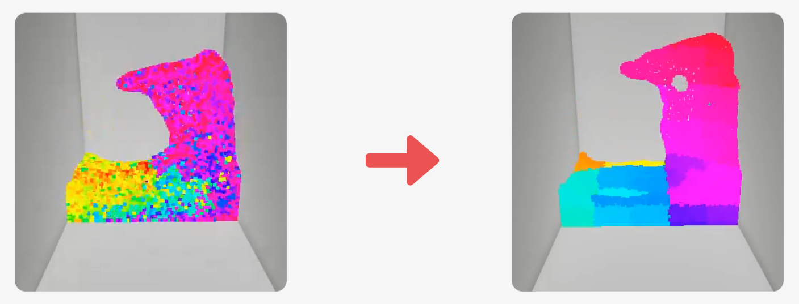
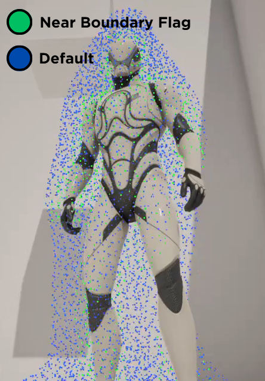

# Kawaii Fluid System

**Kawaii Fluid** is a high-performance, 2-way interactive viscous fluid system for Unreal Engine
5.7. It delivers real-time, high-fidelity liquid dynamics by combining **XPBD** and **XSPH** solvers
with a highly optimized GPU pipeline.

## 🏗️ Core Architecture

### KawaiiFluidRuntime

The engine of the system, handling massive parallel calculations.

* **GPU Pipeline**: Uses **SoA (Structure of Arrays)** to minimize memory traffic, resulting in up
  to 81% bandwidth reduction.
* **Physics Solvers**:
    * **XPBD**: Handles Density & Pressure with Poly6 and Spiky kernels for stability and
      incompressibility.
    * **XSPH**: Manages Viscosity & Cohesion with Laplacian-based velocity diffusion for realistic
      fluid friction.
* **Collision & Interaction**:
    * **Bone Colliders**: 2-way impulse exchange between skeletal meshes and fluid.
    * **Character Attachment**: Boundary tagging for fluid sticking to moving characters.

## 🚀 Core Technologies

### 1. Performance Optimization

* **Bandwidth Reduction**: Utilizing SoA and Half-Precision packing to maximize GPU throughput.
* **Z-Order Sorting**: Improving data cache hits by 2-5x by sorting particles in 3D-to-1D Morton
  order.
  

### 2. Screen Space Fluid Rendering

A multi-pass pipeline for high-quality visual results:

1. **Thickness & Depth Mapping**: Capturing particle volume and surface distance.
2. **Anisotropic Smoothing**: Creating smooth, water-like surfaces without losing details.
3. **Optical Processing**: Simulating refraction, Jacobian Caustics, and Screen Space Reflection.

### 3. Dynamic 2-Way Interaction

Real-time feedback loop between fluid particles and game actors.

* **Force Feedback**: Actors receive impulses based on fluid velocity and density via ReadBack-based
  event triggers.
* **Boundary Tagging**: Specialized logic for character-fluid attachment and boundary behavior.
  

---

Copyright 2026 Team_Bruteforce. All Rights Reserved.