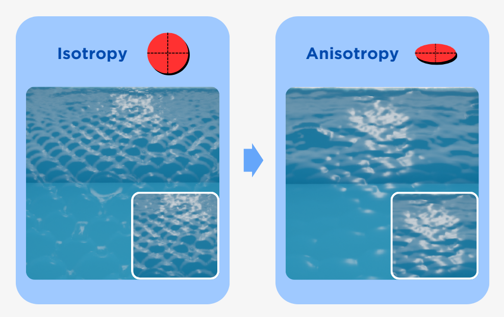

# Rendering Option Guide

This guide describes the parameters available in the **Fluid Rendering Parameters** section of the Kawaii Fluid Volume. These settings control the visual appearance, material properties, and screen-space post-processing of the fluid.

---

## 1. Color and Opacity

These settings define the base look of the liquid and how light is absorbed as it passes through.

| Setting | Description | Range |
| --- | --- | --- |
| **Fluid Color** | The base tint of the liquid. | Color (RGB) |
| **Absorption Strength** | How quickly light fades as it travels through the fluid. 0 is transparent, 1 is opaque. | 0.0 ~ 1.0 |
| **Thickness Scale** | Multiplier for the calculated fluid thickness. Higher values make the fluid appear denser. | 0.1 ~ 10.0 |
| **Thickness Sensitivity** | Controls how much thickness affects opacity. 0 is uniform, 1 makes thin areas very transparent. | 0.0 ~ 1.0 |
| **Enable Thickness Clamping** | If enabled, limits the thickness values to a specific range. | Boolean |
| **Thickness Min / Max** | The range used for clamping thickness. Useful for avoiding extreme visual artifacts. | Min: 0+, Max: ~50 |

---

## 2. Lighting and Specular

Controls how the fluid surface reacts to scene lights and ambient environment lighting.

| Setting | Description | Range |
| --- | --- | --- |
| **Ambient Intensity** | Scaler for the ambient light contribution (from SkyLight). | 0.0 ~ 1.0 |
| **Lighting Scale** | Overall multiplier for combined diffuse and ambient lighting. Useful for HDR adjustment. | 0.01 ~ 1.0 |
| **Specular Strength** | Intensity of direct light highlights on the surface. | 0.0 ~ 2.0 |
| **Specular Roughness** | Controls the sharpness of highlights. Lower is glossy, higher is matte. | 0.01 ~ 1.0 |
| **Fresnel Strength** | Multiplier for the edge reflection effect. Higher values make edges more reflective. | 0.0 ~ 5.0 |

---

## 3. Refraction and Caustics

Advanced optical effects that simulate light bending and focusing through the liquid.

| Setting | Description | Range |
| --- | --- | --- |
| **Enable Refraction** | Toggles the distortion of objects behind the fluid. | Boolean |
| **Refractive Index (IOR)** | The physical Index of Refraction (Water: 1.33, Glass: 1.5). | 1.0 ~ 2.0 |
| **Refraction Scale** | Intensity of the screen-space distortion offset. | 0.0 ~ 0.2 |
| **Enable Caustics** | Toggles light focusing patterns on the background. Requires Refraction. | Boolean |
| **Caustic Intensity** | Brightness of the caustic patterns. | 0.0 ~ 5.0 |

---

## 4. Depth and Smoothing (SSFR)

These parameters control the Screen-Space Fluid Rendering (SSFR) pipeline, which turns discrete particles into a smooth liquid surface.

| Setting | Description | Range |
| --- | --- | --- |
| **Particle Render Radius** | The visual size of each particle (in cm). Should match simulation radius. | 0.5 ~ 100.0 |
| **Smoothing World Scale** | Multiplier for the blur radius relative to particle screen size. | 0.5 ~ 5.0 |
| **Smoothing Min/Max Radius** | Clamps for the blur radius in pixels. Limits GPU cost and over-sharpening. | 1 ~ 64 |
| **Smoothing Iterations** | Number of blur passes. More iterations result in a smoother surface but higher GPU cost. | 1 ~ 10 |
| **Threshold Ratio** | Controls blending distance between particles. Lower preserves droplets. | 0.5 ~ 20.0 |
| **Clamp Ratio** | Limits how much closer particles can appear after smoothing. Prevents surface holes. | 0.1 ~ 5.0 |
| **Grazing Angle Boost** | Extra smoothing applied at steep viewing angles to reduce edge flickering. | 0.0 ~ 2.0 |

---

## 5. Reflection

Kawaii Fluid supports multiple reflection modes for balancing performance and quality.

| Setting | Description | Range |
| --- | --- | --- |
| **Reflection Mode** | None, Cubemap (Static), SSR (Real-time), or SSR + Cubemap Fallback. | Enum |
| **Fresnel Reflection Blend** | Multiplier for the Fresnel term when blending reflections at edges. | 0.0 ~ 1.0 |
| **Reflection Cubemap** | The texture used for static environment reflections. | TextureCube |
| **Reflection Intensity** | Overall brightness multiplier for the sampled reflection. | 0.0 ~ 2.0 |
| **Reflection Mip Level** | Cubemap mip level for sampling. Lower = sharp, higher = blurry. | 0.0 ~ 10.0 |
| **SSR Max Steps** | Maximum ray marching steps for Screen Space Reflections. | 64 ~ 512 |
| **SSR Step Size** | Step size in pixels for SSR ray marching. Smaller is more precise. | 0.5 ~ 20.0 |
| **SSR Thickness** | Depth tolerance for detecting ray hits in SSR. Prevents "holes" in reflections. | 0.5 ~ 5.0 |
| **SSR Intensity** | Brightness multiplier for Screen Space Reflections. | 0.0 ~ 1.0 |
| **SSR Edge Fade** | Fade-out width near screen edges to hide abrupt cutoffs. | 0.0 ~ 0.5 |

---

## 6. Anisotropy (Ellipsoid Rendering)

Anisotropy renders particles as ellipsoids instead of spheres, creating much smoother, "sheet-like" surfaces for moving fluids.

| Setting | Description | Range |
| --- | --- | --- |
| **Enabled** | Toggles ellipsoid-based rendering. | Boolean |
| **Mode** | Velocity-based, Density-based (Covariance), or Hybrid. | Enum |
| **Strength** | Overall ellipsoid effect intensity. 0 = spheres, 1 = normal. | 0.0 ~ 5.0 |
| **Preserve Volume** | Maintains constant volume (S1*S2*S3=1) during stretching. | Boolean |
| **Min / Max Stretch** | Clamps for axis ratios to prevent extreme elongation or flattening. | Min: 0.1~0.9, Max: 1~5 |
| **Velocity Stretch Factor** | How much speed contributes to stretching in Velocity/Hybrid modes. | 0.0 ~ 1.0 |
| **Density Weight** | Balance between velocity and density in Hybrid mode. | 0.0 ~ 1.0 |
| **Update Interval** | Frames between anisotropy updates for optimization. | 1 ~ 10 |
| **Temporal Smoothing** | Blends ellipsoid orientation with the previous frame to reduce flickering. | Boolean |

---

## 7. Surface Decoration

Surface Decoration adds visual layers like foam, glow, and custom textures on top of the fluid surface.

### Foam Settings
| Setting | Description |
| --- | --- |
| **Foam Color / Intensity** | Tint and brightness of the generated foam. |
| **Foam Texture / Tiling** | Texture pattern and its density on the surface. |
| **Velocity Threshold** | Minimum speed required to generate foam (cm/s). |
| **Wave Crest Foam** | Generate foam at wave peaks and breaking points. |
| **Thickness Foam** | Generate foam in thin fluid regions (spray, droplets). |
| **Velocity Smoothing** | Blurs foam boundaries to remove sharp particle edges. |

### Emissive Settings
| Setting | Description |
| --- | --- |
| **Emissive Color / Intensity** | Glow color (HDR) and master brightness multiplier. |
| **Min Emissive** | Minimum glow brightness, even when stationary. |
| **Velocity Response** | Faster flow results in brighter glow (ideal for lava). |
| **Pulse Period / Amplitude** | Animation settings for cyclic glowing effects. |

### Flow Animation
| Setting | Description |
| --- | --- |
| **Enabled** | Textures move along the surface according to fluid velocity. |
| **Flow Speed / Scale** | Overall speed and scaling of the flow-based animation. |
| **Distortion Strength** | Amount of UV warping based on flow vectors. |
| **Flow Decay** | How quickly flow offset returns to rest when velocity stops. |

---

## Detailed Explanations

### Anisotropy Mode: Density vs. Velocity
*   **Density Based:** Analyzes the distribution of neighbor particles to determine the stretch direction. Best for static or slow-moving pools to create smooth surfaces.
*   **Velocity Based:** Stretches particles along their movement vector. Ideal for fast-moving streams or splashes.
*   **Hybrid:** Combines both methods for the most realistic results in dynamic scenarios.

### Screen-Space Fluid Rendering (SSFR)
Kawaii Fluid uses an advanced smoothing algorithm that performs anisotropic blurring on the depth buffer. This process preserves sharp silhouettes while blending the internal particle depths into a continuous surface. The **Threshold Ratio** and **Clamp Ratio** are key to balancing between "droplet" looks and "smooth water" looks.

### SSR + Cubemap Fallback
For professional projects, it is recommended to use **Screen Space Reflection With Cubemap**. This provides the most realistic real-time reflections for screen-visible objects while ensuring the fluid still looks good when rays point towards the sky or off-screen.